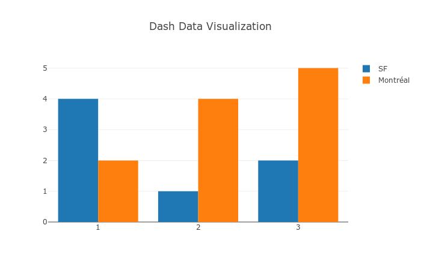
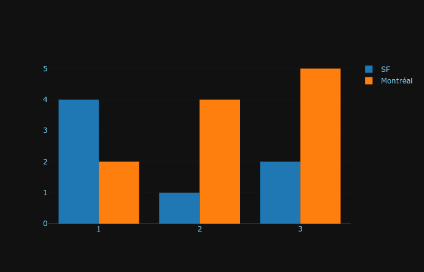

## インストール

ターミナル上でいくつかのdashライブラリをインストールしてください。これらのライブラリは開発中のものなのでインストールとアップグレードを頻繁に行うことを推奨します。Python2とPython3をサポートしています。

> pip install dash==0.21.0  # The core dash backend  
> pip install dash-renderer==0.11.3  # The dash front-end 
> pip install dash-html-components==0.9.0  # HTML components  
> pip install dash-core-components==0.20.2  # Supercharged components  
> pip install plotly --upgrade  # Plotly graphing library used in examples  


## Dash App Layout

### DashでHTMLを生成する

Dashアプリケーションは２つの部分に分けられます。１つ目はアプリケーションの`layout`と呼ばれる部分でアプリケーションの見え方が宣言されます。２つ目はアプリケーションの対話性を書く部分です。  

Dashはアプリケーションのすべての視覚的なコンポーネントのためのPythonのクラスを提供します。われわれは`dash_core_components`と`dash_html_components`ライブラリの中の一連のコンポーネントを用意していますが、JavaScriptあるいはReact.jsをも用いることであなた自身のものを作ることもできます。  

まずはじめに、次の`app.py`という名前のコードを作成してください。  
```python
# -*- coding: utf-8 -*-
import dash
import dash_core_components as dcc
import dash_html_components as html

app = dash.Dash()

app.layout = html.Div(children=[
    html.H1(children='Hello Dash'),

    html.Div(children='''
        Dash: A web application framework for Python.
    '''),

    dcc.Graph(
        id='example-graph',
        figure={
            'data': [
                {'x': [1, 2, 3], 'y': [4, 1, 2], 'type': 'bar', 'name': 'SF'},
                {'x': [1, 2, 3], 'y': [2, 4, 5], 'type': 'bar', 'name': u'Montréal'},
            ],
            'layout': {
                'title': 'Dash Data Visualization'
            }
        }
    )
])

if __name__ == '__main__':
    app.run_server(debug=True)

```

次のコマンドを実行してアプリケーションを走らせてください。  

$python app.py  
...Running on http://127.0.0.1:8050/ (Press CTRL+C to quit)  


あなたのブラウザで`http://127.0.0.1:8050`を訪れてみてください。次のようなアプリケーションを見ることができるはずです。 (公式チュートリアルでは実際にインタラクティブなプロットを見ることができますが、ここでは画像の埋め込み行っています) 

 


注意：  
1.`layout`は`html.Div`や`dcc.Graph`のように"components"の木で構成されています。  
2.`dash_html_components`ライブラリはすべてのHTMLタグのためのコンポーネントをもっています。`html.H1(children='Hello Dash')`コンポーネントは`<h1>Hello Dash</h1>`というHTML要素をあなたのアプリケーション中に生成します。  
3.すべてのコンポーネントが純粋なHTMLというわけではありません。`dash_core_components`は高階のコンポーネントですが対話的でありReact.jsライブラリを通じてJavaScript,HTML,CSSとともに生成されます。  
4.各々のコンポーネントはキーワードプロパティを通じて宣言されます。Dashは宣言型ですので、主にこうしたプロパティを通じてあなたのアプリケーションを宣言することになります。  
5.`children`プロパティは特別です。規定によりそのプロパティは常に、それを省略することができるということを意味での第一プロパティです。例えば`html.H1(children='Hello Dash')`は`html.H1('Hello Dash')`と同様です。また、文字列、数字、単一コンポーネント、コンポーネントのリストを含めることができます。  
6.あなたのアプリケーション中のフォントはここで表示されているものとはやや見え方が異なることでしょう。このアプリケーションはカスタマイズされたCSSスタイルシートをも用いています。これは要素のデフォルトのスタイルを修正するためのものです。より多くのことは`css tutorial`で学ぶことができますが、ここでは次の行をあなたのファイルに付け加えてみることにします。  

app.css.append_css({"external_url": "https://codepen.io/chriddyp/pen/bWLwgP.css"})

これで例題をここでのものと同じものに感じることができたのではないでしょうか。


### HTMLについてもう少し

`dash_core_components`ライブラリというはGraphと呼ばれるコンポーネントを含んでいます。  

コンポーネントのインラインスタイルを修正してアプリケーション中のテキストをカスタマイズしてみましょう。  
```python
# -*- coding: utf-8 -*-
import dash
import dash_core_components as dcc
import dash_html_components as html

app = dash.Dash()

colors = {
    'background': '#111111',
    'text': '#7FDBFF'
}

app.layout = html.Div(style={'backgroundColor': colors['background']}, children=[
    html.H1(
        children='Hello Dash',
        style={
            'textAlign': 'center',
            'color': colors['text']
        }
    ),

    html.Div(children='Dash: A web application framework for Python.', style={
        'textAlign': 'center',
        'color': colors['text']
    }),

    dcc.Graph(
        id='example-graph-2',
        figure={
            'data': [
                {'x': [1, 2, 3], 'y': [4, 1, 2], 'type': 'bar', 'name': 'SF'},
                {'x': [1, 2, 3], 'y': [2, 4, 5], 'type': 'bar', 'name': u'Montréal'},
            ],
            'layout': {
                'plot_bgcolor': colors['background'],
                'paper_bgcolor': colors['background'],
                'font': {
                    'color': colors['text']
                }
            }
        }
    )
])

if __name__ == '__main__':
    app.run_server(debug=True)

```

 


この例のなかでわれわれは`style`プロパティとともに`html.Div`コンポーネントおよび`html.H1`コンポーネントのインラインスタイルを修正しました。

`html.H1('Hello Dash', style={'textAlign': 'center', 'color': '#7FDFF'})`はDashアプリケーションの中では`<h1 style="text-align: center; color: #7FDFF">Hello Dash</h1>`としてレンダリングされます。  

`dash_html_components`とHTMLプロパティの間にはいくつかの重要な違いがあります。  

1.HTMLにおける`style`プロパティはセミコロンで分けられる文字列です。Dashの中ではディクショナリを与えればよいだけです。  
2.`style`ディクショナリにおけるキーはキャメルケースになっています。したがって、`text-align`の代わりにtextAlignが用いられます。  
3.HTMLの`class`プロパティはDashでは`className`となります。  
4.HTMLタグの子供は`children`キーワード引数を通じて特定されます。規定より、これは常に第１引数でありしばしば省かれます。  

これらに加えてさらに、手に入るHTMLプロパティとタグの全てはあなたのPythonコンテキストの範囲内で使うことができます。  


### 再利用可能なコンポーネント

Pythonでマークアップを書くことによって複雑で再利用可能なコンポーネントをつくることができます。たとえば、コンテキストや言語を切り替えることのないテーブルなどです。  

Pandasデータフレームから`Table`をつくる簡単な例を示します。  
```python
import dash
import dash_core_components as dcc
import dash_html_components as html

import pandas as pd

df = pd.read_csv(
    'https://gist.githubusercontent.com/chriddyp/'
    'c78bf172206ce24f77d6363a2d754b59/raw/'
    'c353e8ef842413cae56ae3920b8fd78468aa4cb2/'
    'usa-agricultural-exports-2011.csv')


def generate_table(dataframe, max_rows=10):
    return html.Table(
        # Header
        [html.Tr([html.Th(col) for col in dataframe.columns])] +

        # Body
        [html.Tr([
            html.Td(dataframe.iloc[i][col]) for col in dataframe.columns
        ]) for i in range(min(len(dataframe), max_rows))]
    )


app = dash.Dash()

app.layout = html.Div(children=[
    html.H4(children='US Agriculture Exports (2011)'),
    generate_table(df)
])

if __name__ == '__main__':
    app.run_server(debug=True)
```

(訳者注:上記のコードを実行して`localhost:8050`を訪れればテーブルが表示されることを確認できるはずです)  


### 可視化についてさらに

`dash_core_components`ライブラリは`Graph`と呼ばれるコンポーネントを含んでいます。  

`Graph`は`plotly.js`というJavaScriptライブラリを使って対話的な可視化をレンダリングしています。Plotly.jsは35種類以上のチャートをサポートしておりSVGおよびWebGLのチャートをレンダリングします。  

`dash_core_components.Graph`コンポーネントの`figure`引数はPythonのグラフライブラリである`plotly.py`で使われている引数の`figure`と同じです。詳しく知りたければ`plotly.py documentation and gallery`をチェックしてみてください。

Pandasデータフレームから散布図を作成する例を挙げます。
```python
import dash
import dash_core_components as dcc
import dash_html_components as html
import plotly.graph_objs as go
import pandas as pd

app = dash.Dash()

df = pd.read_csv(
    'https://gist.githubusercontent.com/chriddyp/' +
    '5d1ea79569ed194d432e56108a04d188/raw/' +
    'a9f9e8076b837d541398e999dcbac2b2826a81f8/'+
    'gdp-life-exp-2007.csv')


app.layout = html.Div([
    dcc.Graph(
        id='life-exp-vs-gdp',
        figure={
            'data': [
                go.Scatter(
                    x=df[df['continent'] == i]['gdp per capita'],
                    y=df[df['continent'] == i]['life expectancy'],
                    text=df[df['continent'] == i]['country'],
                    mode='markers',
                    opacity=0.7,
                    marker={
                        'size': 15,
                        'line': {'width': 0.5, 'color': 'white'}
                    },
                    name=i
                ) for i in df.continent.unique()
            ],
            'layout': go.Layout(
                xaxis={'type': 'log', 'title': 'GDP Per Capita'},
                yaxis={'title': 'Life Expectancy'},
                margin={'l': 40, 'b': 40, 't': 10, 'r': 10},
                legend={'x': 0, 'y': 1},
                hovermode='closest'
            )
        }
    )
])

if __name__ == '__main__':
    app.run_server()

```

 

これらのグラフは対話的でかつリスポンシブです。値を見るためにポインタを点の上に移動させてみてください。プロットを切り替えるために判例のアイテムをクリックしてみてください。ズームイン/ズームアウトするためにクリックアンドドラッグをしてみてください。データを抽出するためにシフトキーを押したままクリックとドラッグをしてみください。  

### マークダウン

`dash_html_components`ライブラリを通してDashがHTMLを見せる一方でHTMLであなたのコピーを書こうとするとうんざりしてしまうでしょう。テキストの塊を書くために`dash_core_components`ライブラリ内の`Markdown`コンポーネントを使うことができます。
```python
import dash_core_components as dcc
import dash_html_components as html
import dash

app = dash.Dash()

markdown_text = '''
### Dash and Markdown

Dash apps can be written in Markdown.
Dash uses the [CommonMark](http://commonmark.org/)
specification of Markdown.
Check out their [60 Second Markdown Tutorial](http://commonmark.org/help/)
if this is your first introduction to Markdown!
'''

app.layout = html.Div([
    dcc.Markdown(children=markdown_text)
])

if __name__ == '__main__':
    app.run_server()

```

(訳者注:上記のコードを実行して`localhost:8050`を訪れればマークダウンを使って表示されたページをを確認できるはずです)  


### コアコンポーネント

`dash_core_components`はdropdowns、graphs、markdown blocksのような高階コンポーネント含んでいます。

すべてのDashコンポーネント同様にこれらは宣言的に記述されます。設定可能なオプションはすべてコンポーネントのキーワード引数として利用できます。

こうしたコンポーンントの多くをこれからチュートリアルを通じて見ていくことになります。利用可能なコンポーネントはすべて`Dash Core Components Gallery`の中で見ることができます。

利用可能なコンポーネントのいくつかをここで見てみましょう。

```python
# -*- coding: utf-8 -*-
import dash
import dash_html_components as html
import dash_core_components as dcc

app = dash.Dash()

app.layout = html.Div([
    html.Label('Dropdown'),
    dcc.Dropdown(
        options=[
            {'label': 'New York City', 'value': 'NYC'},
            {'label': u'Montréal', 'value': 'MTL'},
            {'label': 'San Francisco', 'value': 'SF'}
        ],
        value='MTL'
    ),

    html.Label('Multi-Select Dropdown'),
    dcc.Dropdown(
        options=[
            {'label': 'New York City', 'value': 'NYC'},
            {'label': u'Montréal', 'value': 'MTL'},
            {'label': 'San Francisco', 'value': 'SF'}
        ],
        value=['MTL', 'SF'],
        multi=True
    ),

    html.Label('Radio Items'),
    dcc.RadioItems(
        options=[
            {'label': 'New York City', 'value': 'NYC'},
            {'label': u'Montréal', 'value': 'MTL'},
            {'label': 'San Francisco', 'value': 'SF'}
        ],
        value='MTL'
    ),

    html.Label('Checkboxes'),
    dcc.Checklist(
        options=[
            {'label': 'New York City', 'value': 'NYC'},
            {'label': u'Montréal', 'value': 'MTL'},
            {'label': 'San Francisco', 'value': 'SF'}
        ],
        values=['MTL', 'SF']
    ),

    html.Label('Text Input'),
    dcc.Input(value='MTL', type='text'),

    html.Label('Slider'),
    dcc.Slider(
        min=0,
        max=9,
        marks={i: 'Label {}'.format(i) if i == 1 else str(i) for i in range(1, 6)},
        value=5,
    ),
], style={'columnCount': 2})

if __name__ == '__main__':
    app.run_server(debug=True)

```

(訳者注:上記のコードを実行して`localhost:8050`を訪れればさまざまなコンポーネントが使われていることを確認できるはずです)  


### help呼び出し

Dashコンポーネントは宣言的です。これらのコンポーネントのすべての設定可能な側面はキーワード引数としてインスタンス化される中で設定されます。Pythonコンソール内でお好きなコンポーネントの`help`呼び出しを行ってみてください。コンポーネントについてより多くのことを学ぶことができますよ。どんな引数を指定することができるのかということを知ることもできます。
```
>>> help(dcc.Dropdown)
class Dropdown(dash.development.base_component.Component)
|  A Dropdown component.
|  Dropdown is an interactive dropdown element for selecting one or more
|  items.
|  The values and labels of the dropdown items are specified in the `options`
|  property and the selected item(s) are specified with the `value` property.
|
|  Use a dropdown when you have many options (more than 5) or when you are
|  constrained for space. Otherwise, you can use RadioItems or a Checklist,
|  which have the benefit of showing the users all of the items at once.
|
|  Keyword arguments:
|  - id (string; optional)
|  - className (string; optional)
|  - disabled (boolean; optional): If true, the option is disabled
|  - multi (boolean; optional): If true, the user can select multiple values
|  - options (list; optional)
|  - placeholder (string; optional): The grey, default text shown when no option is selected
|  - value (string | list; optional): The value of the input. If `multi` is false (the default)
|  then value is just a string that corresponds to the values
|  provided in the `options` property. If `multi` is true, then
|  multiple values can be selected at once, and `value` is an
|  array of items with values corresponding to those in the
|  `options` prop.
```

### まとめ

Dashアプリケーションのlayoutはアプリケーションの見え方を記述してくれます。`layout`はコンポーネントの階層における木の一つです。`dash_html_components`ライブラリはHTMLタグ全てを提供するクラスを持っています。また、キーワード引数は`style`や`className`、`id`といったHTMLプロパティを指定するために使われます。`dash_core_components`ライブラリは制御やグラフのような高階コンポーネントを生成します。

下記を参考として見てみてください：

[dash_core_components gallery]()

[dash_html_components gallery]()


次のパートではこうしたアプリケーションをどのようにして対話的にするのかということについて述べたいと思います。

[Dash Tutorial - Part 2: Basic Callbacks](https://github.com/ksnt/Dash_Translation_into_Japanese/blob/master/dash_tutorial_jap_chap2.md)
