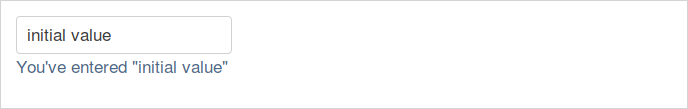
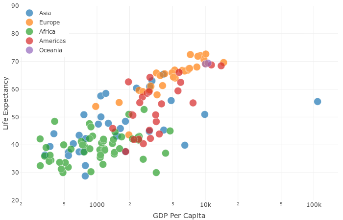
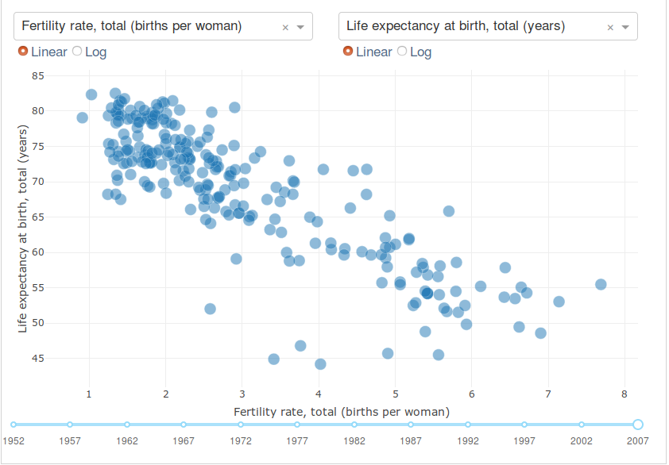
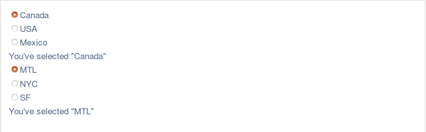
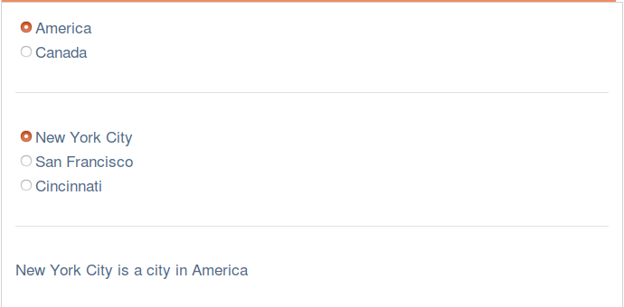

## インストール

ターミナル上でいくつかのdashライブラリをインストールしてください。これらのライブラリは開発中のものなのでインストールとアップグレードを頻繁に行うことを推奨します。Python2とPython3をサポートしています。

> pip install dash==0.21.0  # The core dash backend  
> pip install dash-renderer==0.11.3  # The dash front-end 
> pip install dash-html-components==0.9.0  # HTML components  
> pip install dash-core-components==0.20.2  # Supercharged components  
> pip install plotly --upgrade  # Plotly graphing library used in examples  

## 対話性

### Dashアプリケーションレイアウト

```python
import dash
from dash.dependencies import Input, Output
import dash_core_components as dcc
import dash_html_components as html

app = dash.Dash()

app.layout = html.Div([
    dcc.Input(id='my-id', value='initial value', type='text'),
    html.Div(id='my-div')
])


@app.callback(
    Output(component_id='my-div', component_property='children'),
    [Input(component_id='my-id', component_property='value')]
)
def update_output_div(input_value):
    return 'You\'ve entered "{}"'.format(input_value)


if __name__ == '__main__':
    app.run_server()
```


(訳者注:上記のコードを実行してlocalhost:8050を訪れるとテキストボックスが表示されることを確認できるはずです)

テキストボックスに何かタイプしてみてください。出力コンポーネントの子(children)はただちに更新されます。ここで起こっていることを分解してみましょう：

1.われわれのアプリケーションインターフェースの"入力"と"出力"は`app.callback`デコレーターを通じて宣言的に記述されます。  

2.Dashではアプリケーションの入力と出力は単純に特定のコンポーネントのプロパティとなっています。この例では、入力は"`my-id`"というIDをもったコンポーネントの"value"プロパティです。出力は"`my-id`"というIDをともなうコンポーネントの"`children`"プロパティです。  

3.入力プロパティが変わると、かならずコールバックデコレータがラップ(wrap)する関数が自動的に呼ばれることになります。Dashは入力プロパティの新しい値をもった関数を入力引数として与えます。また、Dashは関数として帰ってきたあらゆるものとともに出力コンポーネントのプロパティを更新します。  

4.`component_id`および`component_property`キーワードはオプショナルです（それらのオブジェクト各々のために2つの引数が存在しているだけです）ここではそれらのプロパティを明快さのために入れることにしましたが簡潔さと読みやすさのために今後は省力することでしょう。

5.`dash.dependencies.Input`オブジェクトと`dash_core_components.Input`オブジェクトを混合しないでください。前者はコールバック内で使われるているだけで、後者は実際にコンポーネントなのです。

6.`layout`内の`my-div`コンポーネントの`children`プロパティのための値をどのようにセットしないようにしえいるかということに注目してください。Dashアプリケーションが起動するとき、出力コンポーネントの初期状態を格納する(populate)ために入力コンポーネントの初期値といっしょにコールバックの全てを自動的に呼び出します。

マイクロソフトのExcelを使ったプログミングのようなものです：入力セルが変わればいつでもそのセルに関係している全てのセルが自動的に更新されます。これは"リアクティブプログラミング(Reactive Programming)"と呼ばれています。

どのようにして全てのコンポーネントがキーワード引数を通じて記述されたかを覚えていますか？ 今、それらのプロパティが重要なのです。Dashの対話性をもってして、われわれはコールバック関数を通じてそれらのプロパティの全てを動的に更新することが出来るのです。しばしば我々は新しいテキストを表示するためにコンポーネントの`children`を更新するでしょう。あるいは、新しいデータを表示するために`dcc.Graph`コンポーネントの`figure`を更新することもあるでしょう。しかし、われわれはコンポーネントの`style`をアップデートするも、さらには`dcc.Dropdown`コンポーネントの`options`さえも更新することが出来るのです！

さあ、`dcc.Slider`が`dcc.Graph`を更新する別の例を見てみましょう。


```python
import dash
import dash_core_components as dcc
import dash_html_components as html
import plotly.graph_objs as go
import pandas as pd

df = pd.read_csv(
    'https://raw.githubusercontent.com/plotly/'
    'datasets/master/gapminderDataFiveYear.csv')

app = dash.Dash()

app.layout = html.Div([
    dcc.Graph(id='graph-with-slider'),
    dcc.Slider(
        id='year-slider',
        min=df['year'].min(),
        max=df['year'].max(),
        value=df['year'].min(),
        step=None,
        marks={str(year): str(year) for year in df['year'].unique()}
    )
])


@app.callback(
    dash.dependencies.Output('graph-with-slider', 'figure'),
    [dash.dependencies.Input('year-slider', 'value')])
def update_figure(selected_year):
    filtered_df = df[df.year == selected_year]
    traces = []
    for i in filtered_df.continent.unique():
        df_by_continent = filtered_df[filtered_df['continent'] == i]
        traces.append(go.Scatter(
            x=df_by_continent['gdpPercap'],
            y=df_by_continent['lifeExp'],
            text=df_by_continent['country'],
            mode='markers',
            opacity=0.7,
            marker={
                'size': 15,
                'line': {'width': 0.5, 'color': 'white'}
            },
            name=i
        ))

    return {
        'data': traces,
        'layout': go.Layout(
            xaxis={'type': 'log', 'title': 'GDP Per Capita'},
            yaxis={'title': 'Life Expectancy', 'range': [20, 90]},
            margin={'l': 40, 'b': 40, 't': 10, 'r': 10},
            legend={'x': 0, 'y': 1},
            hovermode='closest'
        )
    }


if __name__ == '__main__':
    app.run_server()
```


(訳者注:上記のコードを実行してlocalhost:8050を訪れると上のような対話可能なグラフが表示されることを確認できるはずです)

この例では、`Slider`の`"value"`属性がアプリケーションの入力で`Graph`の`"figure"`属性がアプリケーションの出力になっています。`Slider`の`value`が変わるときはいつDashは新しい値とともに`update_figure`というコールバック関数を呼び出します。この関数は新しい値を持ったデータフレームを抽出し、`figure`オブジェクトをつくり、それをDashアプリケーションに返します。  

この例の中にはいくつかのすばらしいパターンが含まれています： 

1. メモリ上でデータセットをインポートしてフィルタリングするために`Pandas`ライブラリを使っています  

2. アプリケーションのはじめの方でデータフレームをロードしています： `df = pd.read_csv('...')`。このデータフレーム`df`はアプリケーション内でグローバルな状態にありコールバック関数内で読み出すことができます。  

3. データをメモリにロードするのはコストがかかります。コールバック関数内ではなくアプリケーションのはじめの部分でデータのクエリをロードすることにより、この操作がアプリケーションサーバーが起動するときにようやく行われるということが保証されます。ユーザーがアプリケーションを訪れたりアプリケーションとやりとりをするとき、そのデータ(`df`)はすでにメモリ上に存在するのです。もし可能であれば、コストのかかる初期化(例えばダウンロードやデータのクエリのようなもの)はコールバック関数内ではなくアプリケーションのグローバルスコープ内でなされるべきです。  

4. コールバックはオリジナルデータを修正することはありません。pandasのfiltersを通して抽出されることでデータフレームのコピーが作られるだけです。これは重要なことです：あなたが書いたコールバックは決してスコープ外の変数を変化させるべきではないのです。もしあなたの書いたコールバックがグローバルな状態を修正したら、あるユーザーのセッションが別のユーザーのセッションに影響を与えてしまうかもしれません。また、アプリケーションが複数のプロセスやスレッド上でデプロイされるとき、そうした修正はセッションを越えて共有されることはないでしょう。  
    
### 複数入力

Dashではすべての"`Output`"は複数の"`Input`"コンポーネントをもつことができます。ここでは5つの`Input`(2つの`Dropdown`コンポーネントの`value`属性、2つの`RadioItems`コンポーネント、そして1つの`Slider`コンポーネント)を1つの`Output`コンポーネント(`Graph`コンポーネントの`figure`属性)にバインドする単純な例を見てみましょう。`app.callback`がどのようにして２つめの引数のリスト内で5つの`dash.dependencies.Input`を並べているのかということに注目してください。

```python
import dash
import dash_core_components as dcc
import dash_html_components as html
import plotly.graph_objs as go
import pandas as pd

app = dash.Dash()

df = pd.read_csv(
    'https://gist.githubusercontent.com/chriddyp/'
    'cb5392c35661370d95f300086accea51/raw/'
    '8e0768211f6b747c0db42a9ce9a0937dafcbd8b2/'
    'indicators.csv')

available_indicators = df['Indicator Name'].unique()

app.layout = html.Div([
    html.Div([

        html.Div([
            dcc.Dropdown(
                id='xaxis-column',
                options=[{'label': i, 'value': i} for i in available_indicators],
                value='Fertility rate, total (births per woman)'
            ),
            dcc.RadioItems(
                id='xaxis-type',
                options=[{'label': i, 'value': i} for i in ['Linear', 'Log']],
                value='Linear',
                labelStyle={'display': 'inline-block'}
            )
        ],
        style={'width': '48%', 'display': 'inline-block'}),

        html.Div([
            dcc.Dropdown(
                id='yaxis-column',
                options=[{'label': i, 'value': i} for i in available_indicators],
                value='Life expectancy at birth, total (years)'
            ),
            dcc.RadioItems(
                id='yaxis-type',
                options=[{'label': i, 'value': i} for i in ['Linear', 'Log']],
                value='Linear',
                labelStyle={'display': 'inline-block'}
            )
        ],style={'width': '48%', 'float': 'right', 'display': 'inline-block'})
    ]),

    dcc.Graph(id='indicator-graphic'),

    dcc.Slider(
        id='year--slider',
        min=df['Year'].min(),
        max=df['Year'].max(),
        value=df['Year'].max(),
        step=None,
        marks={str(year): str(year) for year in df['Year'].unique()}
    )
])

@app.callback(
    dash.dependencies.Output('indicator-graphic', 'figure'),
    [dash.dependencies.Input('xaxis-column', 'value'),
     dash.dependencies.Input('yaxis-column', 'value'),
     dash.dependencies.Input('xaxis-type', 'value'),
     dash.dependencies.Input('yaxis-type', 'value'),
     dash.dependencies.Input('year--slider', 'value')])
def update_graph(xaxis_column_name, yaxis_column_name,
                 xaxis_type, yaxis_type,
                 year_value):
    dff = df[df['Year'] == year_value]

    return {
        'data': [go.Scatter(
            x=dff[dff['Indicator Name'] == xaxis_column_name]['Value'],
            y=dff[dff['Indicator Name'] == yaxis_column_name]['Value'],
            text=dff[dff['Indicator Name'] == yaxis_column_name]['Country Name'],
            mode='markers',
            marker={
                'size': 15,
                'opacity': 0.5,
                'line': {'width': 0.5, 'color': 'white'}
            }
        )],
        'layout': go.Layout(
            xaxis={
                'title': xaxis_column_name,
                'type': 'linear' if xaxis_type == 'Linear' else 'log'
            },
            yaxis={
                'title': yaxis_column_name,
                'type': 'linear' if yaxis_type == 'Linear' else 'log'
            },
            margin={'l': 40, 'b': 40, 't': 10, 'r': 0},
            hovermode='closest'
        )
    }


if __name__ == '__main__':
    app.run_server()
```



(訳者注:上記のコードを実行してlocalhost:8050を訪れると上のような対話可能なグラフが表示されることを確認できるはずです)  

この例では、`Dropdown`、`Slider`、`RadioItems`それぞれのコンポーネントの`value`属性が変化するときはいつでも`update_graph`関数が呼ばれます。  

`update_graph`関数の入力引数は、それらが特定された順に、各`Input`属性の新しい値あるいは現在の値となります。  

たとえ単一の`Input`が一度に変化したとしても(ひとりのユーザーはある瞬間にはひとつのDropdownの値を変えることしかできません)、Dashは特定されたすべての`Input`属性の現在の状態をあつめてそれらをあなたのためのあなたの関数に渡します。あなたの書いたコールバック関数はつねにアプリケーションの代表的な状態に渡されることが保証されるのです。

さあ、複数の出力を含んだ例に拡張しましょう。  

### 複数出力

各々のDashコールバック関数が更新することができるのはひとつの`Output`属性だけです。複数の`Output`を更新するためには複数の関数を書けばよいだけです。

```python
import dash
import dash_core_components as dcc
import dash_html_components as html

app = dash.Dash('')

app.layout = html.Div([
    dcc.RadioItems(
        id='dropdown-a',
        options=[{'label': i, 'value': i} for i in ['Canada', 'USA', 'Mexico']],
        value='Canada'
    ),
    html.Div(id='output-a'),

    dcc.RadioItems(
        id='dropdown-b',
        options=[{'label': i, 'value': i} for i in ['MTL', 'NYC', 'SF']],
        value='MTL'
    ),
    html.Div(id='output-b')

])


@app.callback(
    dash.dependencies.Output('output-a', 'children'),
    [dash.dependencies.Input('dropdown-a', 'value')])
def callback_a(dropdown_value):
    return 'You\'ve selected "{}"'.format(dropdown_value)


@app.callback(
    dash.dependencies.Output('output-b', 'children'),
    [dash.dependencies.Input('dropdown-b', 'value')])
def callback_b(dropdown_value):
    return 'You\'ve selected "{}"'.format(dropdown_value)


if __name__ == '__main__':
    app.run_server()
```



(訳者注:上記のコードを実行してlocalhost:8050を訪れると上のような対話可能なラジオボタンが表示されることを確認できるはずです)

出力と入力をいっしょに連ねることもできます：コールバック関数の出力を別のコールバック関数の入力にすることができます。

このパターンを使うことで動的なUIをつくることができます。ひとつの入力コンポーネントが次の入力コンポーネントのオプションを更新するようなUIをつくることができるということです。さあ、かんたんな例をみてみましょう。

```python
# -*- coding: utf-8 -*-
import dash
from dash.dependencies import Input, Output
import dash_core_components as dcc
import dash_html_components as html

app = dash.Dash(__name__)

all_options = {
    'America': ['New York City', 'San Francisco', 'Cincinnati'],
    'Canada': [u'Montréal', 'Toronto', 'Ottawa']
}
app.layout = html.Div([
    dcc.RadioItems(
        id='countries-dropdown',
        options=[{'label': k, 'value': k} for k in all_options.keys()],
        value='America'
    ),

    html.Hr(),

    dcc.RadioItems(id='cities-dropdown'),

    html.Hr(),

    html.Div(id='display-selected-values')
])


@app.callback(
    dash.dependencies.Output('cities-dropdown', 'options'),
    [dash.dependencies.Input('countries-dropdown', 'value')])
def set_cities_options(selected_country):
    return [{'label': i, 'value': i} for i in all_options[selected_country]]


@app.callback(
    dash.dependencies.Output('cities-dropdown', 'value'),
    [dash.dependencies.Input('cities-dropdown', 'options')])
def set_cities_value(available_options):
    return available_options[0]['value']


@app.callback(
    dash.dependencies.Output('display-selected-values', 'children'),
    [dash.dependencies.Input('countries-dropdown', 'value'),
     dash.dependencies.Input('cities-dropdown', 'value')])
def set_display_children(selected_country, selected_city):
    return u'{} is a city in {}'.format(
        selected_city, selected_country,
    )


if __name__ == '__main__':
    app.run_server(debug=True)
```



(訳者注:上記のコードを実行してlocalhost:8050を訪れると上のような対話可能なラジオボタンが表示されることを確認できるはずです)　　

最初のコールバックは最初の`RadioItems`コンポーネントで選ばれた値をもとにつくられる２つめの`RadioItems`コンポーネント内の選ぶことができる選択肢を更新しています。  

ふたつめのコールバックは`options`の属性が変化したときに初期値を設定します：`options`の配列内の最初の値に設定します。

最後のコールバックは各コンポーネントで選ばれた値を表示しています。もし`RadioItems`コンポーネントつまりは国の値を変えたとすると、Dashは最後のコールバックを呼び出す前に都市のコンポーネントの値が更新されるまで待機するでしょう。こうしたことはあなたが書いたコールバックが`"USA"`と`"Montréal"`といったような不一致な状態をともなって呼び出されることを防ぎます。  

## まとめ

Dashにおけるコールバックの基礎についてカバーしました。Dashアプリケーションは単純ではあるもののパワフルな原理から作りあげられています。それらの原理とは、リアクティブかつファンクショナルなPythonコールバックを通じてカスタム可能な宣言的UIの数々です。宣言的なコンポーネントのすべての要素属性はコールバックを通じて更新することができます。また、`dcc.Dropdown`の`value`属性のような一部の属性はインターフェース内でユーザーが編集することができます。

------------------------------------------------------

次の章では、ページ上のグラフとの対話に対応するアプリケーションをつくるために、`dash_core_components.Graph`コンポーネントと一緒にこうした原理をどのように使うのかということを説明します。

[Part 3 - Interactive Graphing](dash_tutorial_jap_chap3.md)
