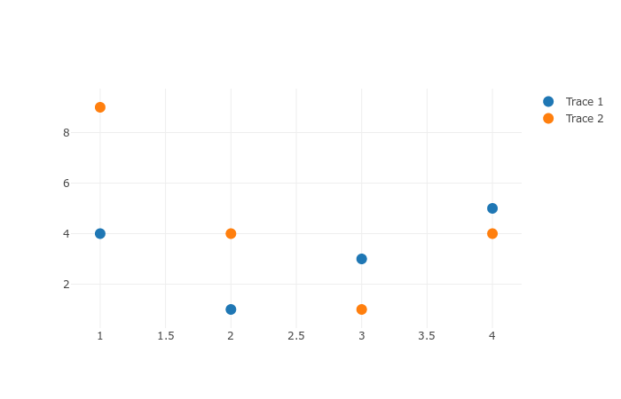
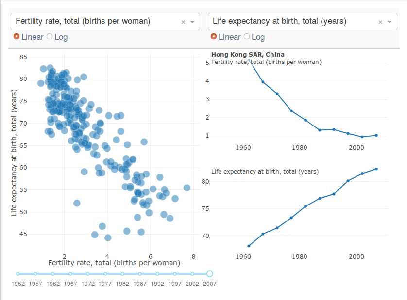
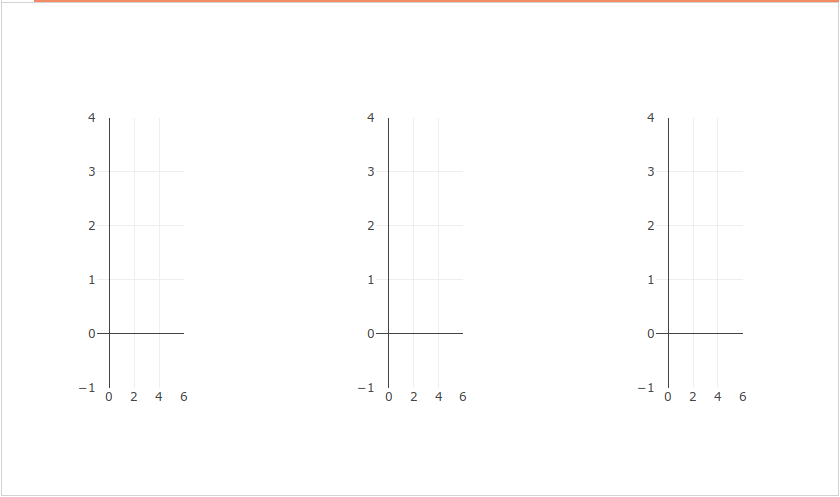

# 対話的な可視化

The dash_core_components library includes a component called Graph.  

Graph renders interactive data visualizations using the open source plotly.js JavaScript graphing library. Plotly.js supports over 35 chart types and renders charts in both vector-quality SVG and high-performance WebGL.  

The figure argument in the dash_core_components.Graph component is the same figure argument that is used by plotly.py, Plotly's open source Python graphing library. Check out the plotly.py documentation and gallery to learn more.  

Dash components are described declaratively by a set of attributes. All of these attributes can be updated by callback functions but only a subset of these attributes are updated through user interaction. For example, when you click on an option in a dcc.Dropdown component, the value property of that component changes.  

The dcc.Graph component has four attributes that can change through user-interaction: hoverData, clickData, selectedData, relayoutData. These properties update when you hover over points, click on points, or select regions of points in a graph.
Here's an simple example that prints these attributes in the screen.   

```python
import json
from textwrap import dedent as d
import dash
from dash.dependencies import Input, Output
import dash_core_components as dcc
import dash_html_components as html


app = dash.Dash(__name__)

styles = {
    'pre': {
        'border': 'thin lightgrey solid',
        'overflowX': 'scroll'
    }
}

app.layout = html.Div([
    dcc.Graph(
        id='basic-interactions',
        figure={
            'data': [
                {
                    'x': [1, 2, 3, 4],
                    'y': [4, 1, 3, 5],
                    'text': ['a', 'b', 'c', 'd'],
                    'customdata': ['c.a', 'c.b', 'c.c', 'c.d'],
                    'name': 'Trace 1',
                    'mode': 'markers',
                    'marker': {'size': 12}
                },
                {
                    'x': [1, 2, 3, 4],
                    'y': [9, 4, 1, 4],
                    'text': ['w', 'x', 'y', 'z'],
                    'customdata': ['c.w', 'c.x', 'c.y', 'c.z'],
                    'name': 'Trace 2',
                    'mode': 'markers',
                    'marker': {'size': 12}
                }
            ]
        }
    ),

    html.Div(className='row', children=[
        html.Div([
            dcc.Markdown(d("""
                **Hover Data**

                Mouse over values in the graph.
            """)),
            html.Pre(id='hover-data', style=styles['pre'])
        ], className='three columns'),

        html.Div([
            dcc.Markdown(d("""
                **Click Data**

                Click on points in the graph.
            """)),
            html.Pre(id='click-data', style=styles['pre']),
        ], className='three columns'),

        html.Div([
            dcc.Markdown(d("""
                **Selection Data**

                Choose the lasso or rectangle tool in the graph's menu
                bar and then select points in the graph.
            """)),
            html.Pre(id='selected-data', style=styles['pre']),
        ], className='three columns'),

        html.Div([
            dcc.Markdown(d("""
                **Zoom and Relayout Data**

                Click and drag on the graph to zoom or click on the zoom
                buttons in the graph's menu bar.
                Clicking on legend items will also fire
                this event.
            """)),
            html.Pre(id='relayout-data', style=styles['pre']),
        ], className='three columns')
    ])
])


@app.callback(
    Output('hover-data', 'children'),
    [Input('basic-interactions', 'hoverData')])
def display_hover_data(hoverData):
    return json.dumps(hoverData, indent=2)


@app.callback(
    Output('click-data', 'children'),
    [Input('basic-interactions', 'clickData')])
def display_click_data(clickData):
    return json.dumps(clickData, indent=2)


@app.callback(
    Output('selected-data', 'children'),
    [Input('basic-interactions', 'selectedData')])
def display_selected_data(selectedData):
    return json.dumps(selectedData, indent=2)


@app.callback(
    Output('relayout-data', 'children'),
    [Input('basic-interactions', 'relayoutData')])
def display_selected_data(relayoutData):
    return json.dumps(relayoutData, indent=2)


if __name__ == '__main__':
    app.run_server(debug=True)

```

 


## ホバー中のグラフのアップデート

Let's update our world indicators example from the previous chapter by updating time series when we hover over points in our scatter plot. 

```python
import dash
import dash_core_components as dcc
import dash_html_components as html
import plotly.graph_objs as go
import pandas as pd

app = dash.Dash()

df = pd.read_csv(
    'https://gist.githubusercontent.com/chriddyp/'
    'cb5392c35661370d95f300086accea51/raw/'
    '8e0768211f6b747c0db42a9ce9a0937dafcbd8b2/'
    'indicators.csv')

available_indicators = df['Indicator Name'].unique()

app.layout = html.Div([
    html.Div([

        html.Div([
            dcc.Dropdown(
                id='crossfilter-xaxis-column',
                options=[{'label': i, 'value': i} for i in available_indicators],
                value='Fertility rate, total (births per woman)'
            ),
            dcc.RadioItems(
                id='crossfilter-xaxis-type',
                options=[{'label': i, 'value': i} for i in ['Linear', 'Log']],
                value='Linear',
                labelStyle={'display': 'inline-block'}
            )
        ],
        style={'width': '49%', 'display': 'inline-block'}),

        html.Div([
            dcc.Dropdown(
                id='crossfilter-yaxis-column',
                options=[{'label': i, 'value': i} for i in available_indicators],
                value='Life expectancy at birth, total (years)'
            ),
            dcc.RadioItems(
                id='crossfilter-yaxis-type',
                options=[{'label': i, 'value': i} for i in ['Linear', 'Log']],
                value='Linear',
                labelStyle={'display': 'inline-block'}
            )
        ], style={'width': '49%', 'float': 'right', 'display': 'inline-block'})
    ], style={
        'borderBottom': 'thin lightgrey solid',
        'backgroundColor': 'rgb(250, 250, 250)',
        'padding': '10px 5px'
    }),

    html.Div([
        dcc.Graph(
            id='crossfilter-indicator-scatter',
            hoverData={'points': [{'customdata': 'Japan'}]}
        )
    ], style={'width': '49%', 'display': 'inline-block', 'padding': '0 20'}),
    html.Div([
        dcc.Graph(id='x-time-series'),
        dcc.Graph(id='y-time-series'),
    ], style={'display': 'inline-block', 'width': '49%'}),

    html.Div(dcc.Slider(
        id='crossfilter-year--slider',
        min=df['Year'].min(),
        max=df['Year'].max(),
        value=df['Year'].max(),
        step=None,
        marks={str(year): str(year) for year in df['Year'].unique()}
    ), style={'width': '49%', 'padding': '0px 20px 20px 20px'})
])


@app.callback(
    dash.dependencies.Output('crossfilter-indicator-scatter', 'figure'),
    [dash.dependencies.Input('crossfilter-xaxis-column', 'value'),
     dash.dependencies.Input('crossfilter-yaxis-column', 'value'),
     dash.dependencies.Input('crossfilter-xaxis-type', 'value'),
     dash.dependencies.Input('crossfilter-yaxis-type', 'value'),
     dash.dependencies.Input('crossfilter-year--slider', 'value')])
def update_graph(xaxis_column_name, yaxis_column_name,
                 xaxis_type, yaxis_type,
                 year_value):
    dff = df[df['Year'] == year_value]

    return {
        'data': [go.Scatter(
            x=dff[dff['Indicator Name'] == xaxis_column_name]['Value'],
            y=dff[dff['Indicator Name'] == yaxis_column_name]['Value'],
            text=dff[dff['Indicator Name'] == yaxis_column_name]['Country Name'],
            customdata=dff[dff['Indicator Name'] == yaxis_column_name]['Country Name'],
            mode='markers',
            marker={
                'size': 15,
                'opacity': 0.5,
                'line': {'width': 0.5, 'color': 'white'}
            }
        )],
        'layout': go.Layout(
            xaxis={
                'title': xaxis_column_name,
                'type': 'linear' if xaxis_type == 'Linear' else 'log'
            },
            yaxis={
                'title': yaxis_column_name,
                'type': 'linear' if yaxis_type == 'Linear' else 'log'
            },
            margin={'l': 40, 'b': 30, 't': 10, 'r': 0},
            height=450,
            hovermode='closest'
        )
    }


def create_time_series(dff, axis_type, title):
    return {
        'data': [go.Scatter(
            x=dff['Year'],
            y=dff['Value'],
            mode='lines+markers'
        )],
        'layout': {
            'height': 225,
            'margin': {'l': 20, 'b': 30, 'r': 10, 't': 10},
            'annotations': [{
                'x': 0, 'y': 0.85, 'xanchor': 'left', 'yanchor': 'bottom',
                'xref': 'paper', 'yref': 'paper', 'showarrow': False,
                'align': 'left', 'bgcolor': 'rgba(255, 255, 255, 0.5)',
                'text': title
            }],
            'yaxis': {'type': 'linear' if axis_type == 'Linear' else 'log'},
            'xaxis': {'showgrid': False}
        }
    }


@app.callback(
    dash.dependencies.Output('x-time-series', 'figure'),
    [dash.dependencies.Input('crossfilter-indicator-scatter', 'hoverData'),
     dash.dependencies.Input('crossfilter-xaxis-column', 'value'),
     dash.dependencies.Input('crossfilter-xaxis-type', 'value')])
def update_y_timeseries(hoverData, xaxis_column_name, axis_type):
    country_name = hoverData['points'][0]['customdata']
    dff = df[df['Country Name'] == country_name]
    dff = dff[dff['Indicator Name'] == xaxis_column_name]
    title = '<b>{}</b><br>{}'.format(country_name, xaxis_column_name)
    return create_time_series(dff, axis_type, title)


@app.callback(
    dash.dependencies.Output('y-time-series', 'figure'),
    [dash.dependencies.Input('crossfilter-indicator-scatter', 'hoverData'),
     dash.dependencies.Input('crossfilter-yaxis-column', 'value'),
     dash.dependencies.Input('crossfilter-yaxis-type', 'value')])
def update_x_timeseries(hoverData, yaxis_column_name, axis_type):
    dff = df[df['Country Name'] == hoverData['points'][0]['customdata']]
    dff = dff[dff['Indicator Name'] == yaxis_column_name]
    return create_time_series(dff, axis_type, yaxis_column_name)


if __name__ == '__main__':
    app.run_server()
```

 

Try mousing over the points in the scatter plot on the left. Notice how the line graphs on the right update based off of the point that you are hovering over.

## Generic Crossfilter Recipe

Here's a slightly more generic example for crossfiltering across a six column data set. Each scatter plot's selection filters the underlying dataset.  
```python
import dash
from dash.dependencies import Input, Output
import dash_core_components as dcc
import dash_html_components as html

import numpy as np
import pandas as pd

app = dash.Dash()

np.random.seed(0)
df = pd.DataFrame({
    'Column {}'.format(i): np.random.rand(30) + i*10
    for i in range(6)})

app.layout = html.Div([
    html.Div(
        dcc.Graph(
            id='g1',
            config={'displayModeBar': False}
        ), className='four columns'
    ),
    html.Div(
        dcc.Graph(
            id='g2',
            config={'displayModeBar': False}
        ), className='four columns'),
    html.Div(
        dcc.Graph(
            id='g3',
            config={'displayModeBar': False}
        ), className='four columns')
], className='row')


def highlight(x, y):
    def callback(*selectedDatas):
        selectedpoints = df.index
        for i, selected_data in enumerate(selectedDatas):
            if selected_data is not None:
                selected_index = [
                    p['customdata'] for p in selected_data['points']
                ]
                if len(selected_index) > 0:
                    selectedpoints = np.intersect1d(
                        selectedpoints, selected_index)


        # set which points are selected with the `selectedpoints` property
        # and style those points with the `selected` and `unselected`
        # attribute. see
        # https://medium.com/@plotlygraphs/notes-from-the-latest-plotly-js-release-b035a5b43e21
        # for an explanation

        figure = {
            'data': [
                {
                    'x': df[x],
                    'y': df[y],
                    'text': df.index,
                    'textposition': 'top',
                    'selectedpoints': selectedpoints,
                    'customdata': df.index,
                    'type': 'scatter',
                    'mode': 'markers+text',
                    'textposition': 'top',
                    'marker': {
                        'color': 'rgba(0, 116, 217, 0.7)',
                        'size': 12,
                        'line': {
                            'color': 'rgb(0, 116, 217)',
                            'width': 0.5
                        }
                    },
                    'textfont': {
                        'color': 'rgba(30, 30, 30, 1)'
                    },
                    'unselected': {
                        'marker': {
                            'opacity': 0.3,
                        },
                        'textfont': {
                            # make text transparent when not selected
                            'color': 'rgba(0, 0, 0, 0)'
                        }
                    }
                },
            ],
            'layout': {
                'margin': {'l': 15, 'r': 0, 'b': 15, 't': 5},
                'dragmode': 'select',
                'hovermode': 'closest',
                'showlegend': False
            }
        }

        # Display a rectangle to highlight the previously selected region
        shape = {
            'type': 'rect',
            'line': {
                'width': 1,
                'dash': 'dot',
                'color': 'darkgrey'
            }
        }
        if selectedDatas[0] and selectedDatas[0]['range']:
            figure['layout']['shapes'] = [dict({
                'x0': selectedDatas[0]['range']['x'][0],
                'x1': selectedDatas[0]['range']['x'][1],
                'y0': selectedDatas[0]['range']['y'][0],
                'y1': selectedDatas[0]['range']['y'][1]
            }, **shape)]
        else:
            figure['layout']['shapes'] = [dict({
                'type': 'rect',
                'x0': np.min(df[x]),
                'x1': np.max(df[x]),
                'y0': np.min(df[y]),
                'y1': np.max(df[y])
            }, **shape)]

        return figure

    return callback


app.css.append_css({
    'external_url': 'https://codepen.io/chriddyp/pen/bWLwgP.css'})

# app.callback is a decorator which means that it takes a function
# as its argument.
# highlight is a function "generator": it's a function that returns function
app.callback(
    Output('g1', 'figure'),
    [Input('g1', 'selectedData'),
     Input('g2', 'selectedData'),
     Input('g3', 'selectedData')]
)(highlight('Column 0', 'Column 1'))

app.callback(
    Output('g2', 'figure'),
    [Input('g2', 'selectedData'),
     Input('g1', 'selectedData'),
     Input('g3', 'selectedData')]
)(highlight('Column 2', 'Column 3'))

app.callback(
    Output('g3', 'figure'),
    [Input('g3', 'selectedData'),
     Input('g1', 'selectedData'),
     Input('g2', 'selectedData')]
)(highlight('Column 4', 'Column 5'))

if __name__ == '__main__':
    app.run_server(debug=True)
```

 

Try clicking and dragging in any of the plots to filter different regions. On every selection, the three graph callbacks are fired with the latest selected regions of each plot. A pandas dataframe is filtered based off of the selected points and the graphs are replotted with the selected points highlighted and the selected region drawn as a dashed rectangle.

> As an aside, if you find yourself filtering and visualizing highly-dimensional datasets, you should consider checking out the parallel coordinates chart type.

## 現在の限界

There are a few limitations in graph interactions right now.

Clicking points does not accumulate: you cannot accumulate the number of points that you have clicked on nor is there the concept of "unselecting" a point. This issue is being worked on in https://github.com/plotly/plotly.js/issues/1848.  

It is not currently possible to customize the style of the hover interactions or the select box. This issue is being worked on in https://github.com/plotly/plotly.js/issues/1847.  

There's a lot that you can do with these interactive plotting features. If you need help exploring your use case, open up a thread in the Dash Community Forum.  

The final chapter of the Dash tutorial explains one last concept of dash: Callbacks with dash.dependencies.State. State is useful for UIs that contain forms or buttons.  

[Dash Tutorial Part 4. Callbacks With State](./dash_tutorial_jap_chap5.md)
